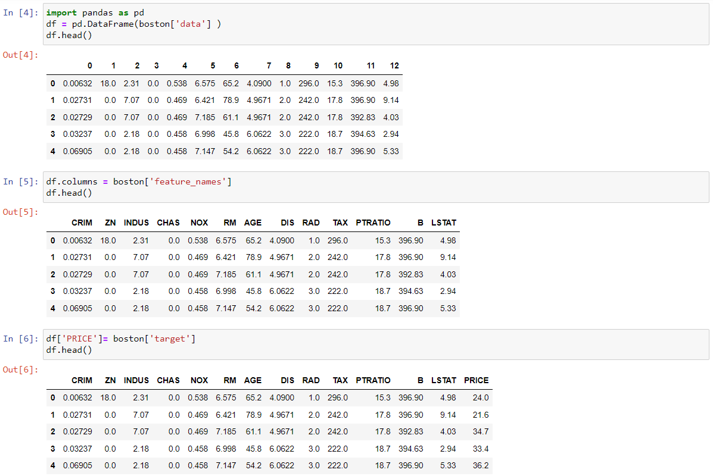
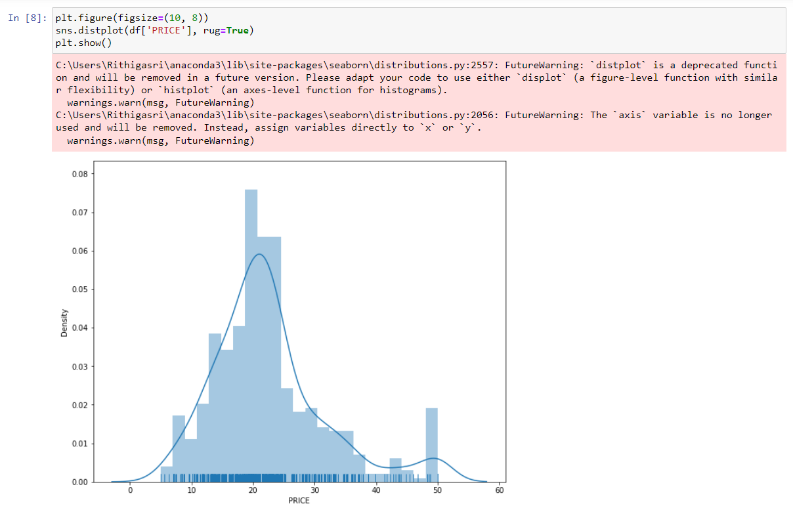
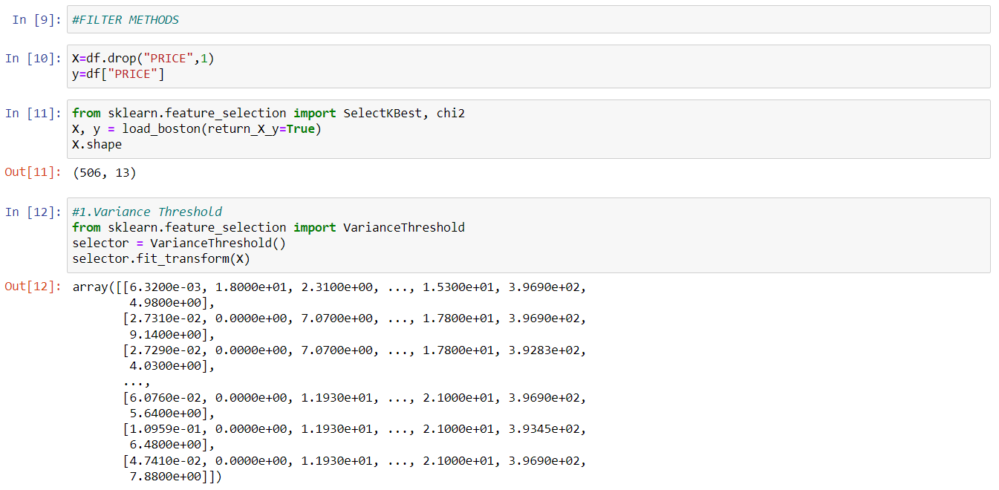
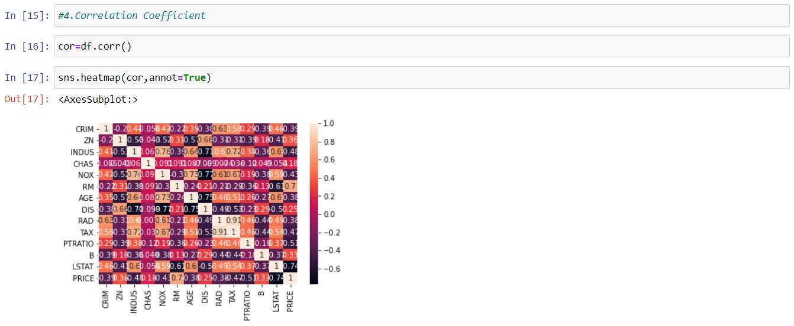
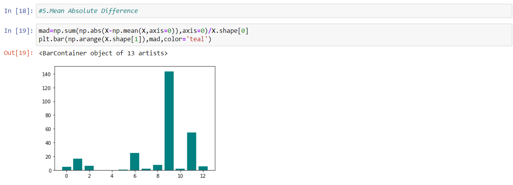
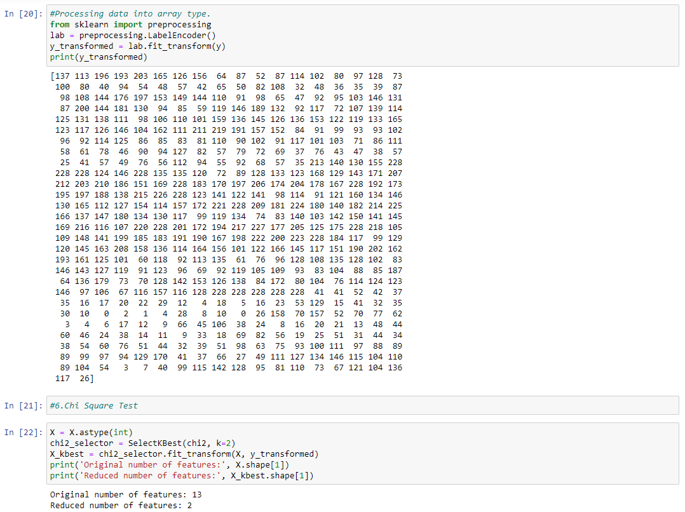
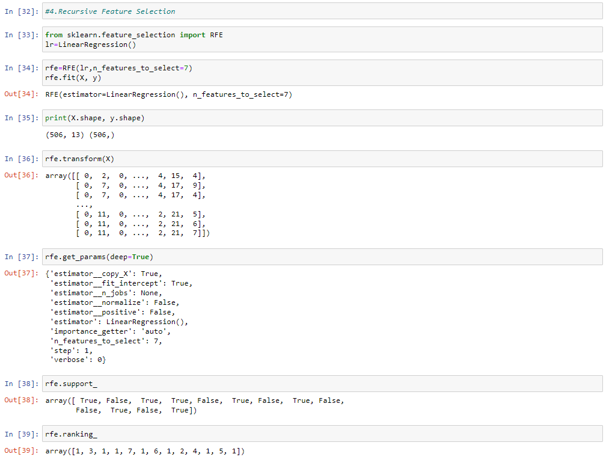
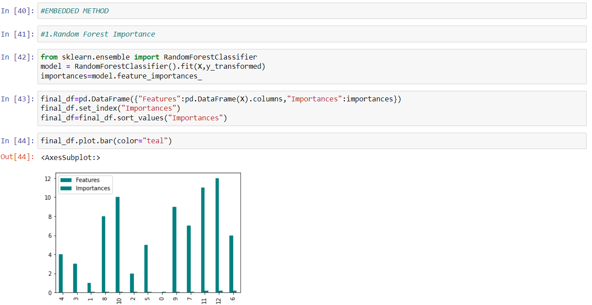

# EX-07-FEATURE SELECTION
## AIM:
To Perform the various feature selection techniques on a dataset and save the data to a file. 

## EXPLANATION:
Feature selection is to find the best set of features that allows one to build useful models.
Selecting the best features helps the model to perform well.   
The feature selection techniques used are:  
1.Filter Method  
2.Wrapper Method  
3.Embedded Method  

## ALGORITHM
### STEP 1:
Read the given Data.
### STEP 2:
Clean the Data Set using Data Cleaning Process.
### STEP 3:
Apply Feature selection techniques to all the features of the data set.
### STEP 4:
Save the data to the file.


## CODE:
```
#Importing libraries
from sklearn.datasets import load_boston
import pandas as pd
import numpy as np
import matplotlib
import matplotlib.pyplot as plt
import seaborn as sns
import statsmodels.api as sm
%matplotlib inline
from sklearn.model_selection import train_test_split
from sklearn.linear_model import LinearRegression
from sklearn.feature_selection import RFE
from sklearn.linear_model import RidgeCV, LassoCV, Ridge, Lasso

from sklearn.datasets import load_boston
boston = load_boston()

print(boston['DESCR'])

import pandas as pd
df = pd.DataFrame(boston['data'] )
df.head()

df.columns = boston['feature_names']
df.head()

df['PRICE']= boston['target']
df.head()

df.info()

plt.figure(figsize=(10, 8))
sns.distplot(df['PRICE'], rug=True)
plt.show()

#FILTER METHODS

X=df.drop("PRICE",1)
y=df["PRICE"]

from sklearn.feature_selection import SelectKBest, chi2
X, y = load_boston(return_X_y=True)
X.shape

#1.Variance Threshold
from sklearn.feature_selection import VarianceThreshold
selector = VarianceThreshold()
selector.fit_transform(X)

#2.Information gain/Mutual Information
from sklearn.feature_selection import mutual_info_regression
mi = mutual_info_regression(X, y);
mi = pd.Series(mi)
mi.sort_values(ascending=False)
mi.sort_values(ascending=False).plot.bar(figsize=(10, 4))

#3.SelectKBest Model
from sklearn.feature_selection import f_classif
from sklearn.feature_selection import SelectKBest,SelectPercentile
skb = SelectKBest(score_func=f_classif, k=2) 
X_data_new = skb.fit_transform(X, y)
print('Number of features before feature selection: {}'.format(X.shape[1]))
print('Number of features after feature selection: {}'.format(X_data_new.shape[1]))

#4.Correlation Coefficient
cor=df.corr()
sns.heatmap(cor,annot=True)

#5.Mean Absolute Difference
mad=np.sum(np.abs(X-np.mean(X,axis=0)),axis=0)/X.shape[0]
plt.bar(np.arange(X.shape[1]),mad,color='teal')

#Processing data into array type.
from sklearn import preprocessing
lab = preprocessing.LabelEncoder()
y_transformed = lab.fit_transform(y)
print(y_transformed)

#6.Chi Square Test
X = X.astype(int)
chi2_selector = SelectKBest(chi2, k=2)
X_kbest = chi2_selector.fit_transform(X, y_transformed)
print('Original number of features:', X.shape[1])
print('Reduced number of features:', X_kbest.shape[1])

#7.SelectPercentile method
X_new = SelectPercentile(chi2, percentile=10).fit_transform(X, y_transformed)
X_new.shape

#WRAPPER METHOD

#1.Forward feature selection

from mlxtend.feature_selection import SequentialFeatureSelector as SFS
from sklearn.linear_model import LinearRegression
sfs = SFS(LinearRegression(),
          k_features=10,
          forward=True,
          floating=False,
          scoring = 'r2',
          cv = 0)
sfs.fit(X, y)
sfs.k_feature_names_

#2.Backward feature elimination

sbs = SFS(LinearRegression(),
         k_features=10,
         forward=False,
         floating=False,
         cv=0)
sbs.fit(X, y)
sbs.k_feature_names_

#3.Bi-directional elimination

sffs = SFS(LinearRegression(),
         k_features=(3,7),
         forward=True,
         floating=True,
         cv=0)
sffs.fit(X, y)
sffs.k_feature_names_

#4.Recursive Feature Selection

from sklearn.feature_selection import RFE
lr=LinearRegression()
rfe=RFE(lr,n_features_to_select=7)
rfe.fit(X, y)
print(X.shape, y.shape)
rfe.transform(X)
rfe.get_params(deep=True)
rfe.support_
rfe.ranking_

#EMBEDDED METHOD

#1.Random Forest Importance

from sklearn.ensemble import RandomForestClassifier
model = RandomForestClassifier().fit(X,y_transformed)
importances=model.feature_importances_

final_df=pd.DataFrame({"Features":pd.DataFrame(X).columns,"Importances":importances})
final_df.set_index("Importances")
final_df=final_df.sort_values("Importances")
final_df.plot.bar(color="teal")
```

## OUTPUT:
### Importing required libraries:

### Analyzing the boston dataset:



### Analyzing dataset using Distplot:

### Filter Methods:
* Variance Threshold:

* Information Gain:

* SelectKBest Model:

* Correlation Coefficient:

* Mean Absolute Difference:

* Chi Square Test:

* SelectPercentile Method:

### Wrapper Methods:
* Forward Feature Selection:

* Backward Feature Selection:

* Bi-Directional Elimination:

* Recursive Feature Selection:

### Embedded Methods:
* Random Forest Importance


## RESULT:
Hence various feature selection techniques are applied to the given data set successfully and saved the data into a file.